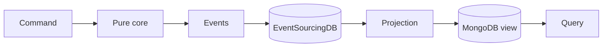
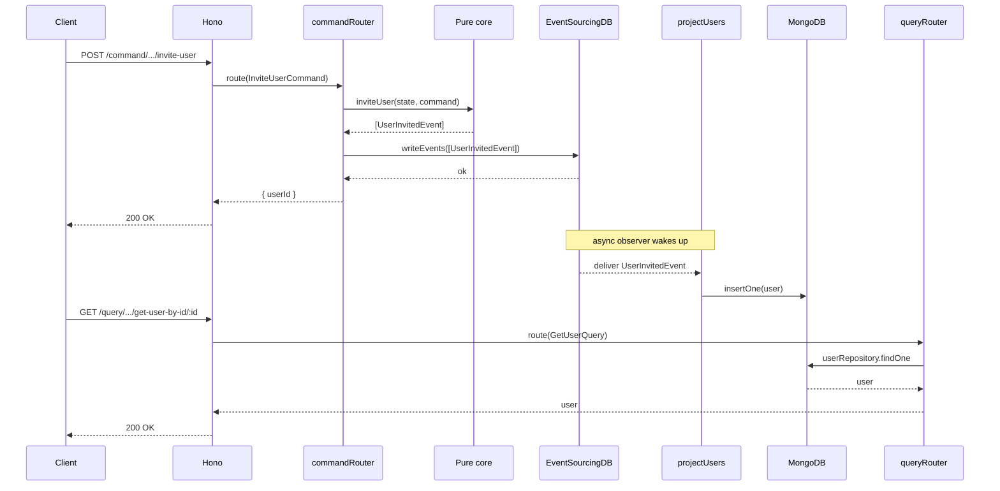

---
next:
    text: "Core"
    link: "/guide/core"
---

# An in Depth Example

This page is dedicated to explain the example application ["eventsourcing-demo"](https://github.com/overlap-dev/Nimbus/tree/main/examples/eventsourcing-demo) in depth with all the underlying concepts and patterns.

If you are new to Nimbus, Event Driven Architecture, Event Sourcing or CQRS, this is the right place to get some better insights on how everything works.

## How to Read This Page

Take your time. There is nothing to memorize, and you will not be tested at the end. Every concept on this page is introduced in plain English first and only then shown in code, so feel free to skim, jump back, and re-read sections that feel new.

The demo itself is small. About 25 short, well-commented files. The most rewarding way to follow along is to clone the repo and open it in your editor next to this page. Whenever you see a file path mentioned, `CMD+Click` (or `F12`) on a function name in the demo to jump straight to its definition.

::: tip Open the code while you read
[examples/eventsourcing-demo](https://github.com/overlap-dev/Nimbus/tree/main/examples/eventsourcing-demo) is the repo. Keep it open in a second window.
:::

## The Mental Model in Five Minutes

Before we open a single file, let us agree on a tiny vocabulary. These four ideas are everything you need to make sense of the demo.

### Events Are Facts

An **event** is something that already happened, written down in a way that cannot be changed afterwards. "Jane was invited at 09:14" is an event. We never edit the past - we only ever append new events to the end of a log.

This sounds modest, but it has a big consequence: the event log becomes the single source of truth. Every other shape of data in your system is derived from it.

### State Is a Fold Over Events

If events are the source of truth, then "current state" is just what you get when you walk through the events in order and apply them one by one. Reduce them, fold them, accumulate them - whichever word you like.

For example, if a user has these two events in the log:

```
1. UserInvited            { id: "abc", email: "jane@x.com", invitedAt: "..." }
2. UserInvitationAccepted { acceptedAt: "..." }
```

Then their current state - "Jane, invited and accepted" - is what you get by replaying both events into an empty `UserState` object. That is the whole trick.

### CQRS: Two Sides of the Same Story

**CQRS** stands for Command Query Responsibility Segregation. The fancy name hides a simple idea: separate the code that **changes** the system from the code that **reads** from it.

-   The **write side** accepts commands ("invite this user"), enforces business rules, and emits events.
-   The **read side** projects those events into shapes that are easy to query ("give me all pending invitations").

Both sides talk through the event log. They do not have to share data models. The read side can have many different views, each optimized for a specific question.

### Pure Core, Imperative Shell

Inside the write side we make one more separation: the **pure core** (the business logic) is wrapped by an **imperative shell** (the I/O). The core is plain functions with no side effects - easy to test, easy to reason about. The shell handles HTTP, databases, and external systems, and calls the core when it is time to think.

The [Architecture](/guide/architecture) page goes into the why and how of this split. For now, just remember: the core is where the business lives, the shell is where the world lives.

### Mapping the Real World (DDD)

We organize the application using **Domain Driven Design** principles. The big idea is simple: the folder structure should look like the real-world business it serves, not like a layered framework. Code that belongs to the same part of the business lives together, and code that belongs to different parts stays apart.

In the demo this shows up as two levels:

-   **Domains** group everything related to one area of the business. Our example has the `iam` (Identity and Access Management) domain. A real application might also have `billing`, `inventory`, or `notifications` next to it.
-   **Modules** live inside a domain and represent a concept the domain cares about. Inside `iam` we have a `users` module. Later we might add `roles` or `permissions` modules right beside it.

So `iam/users` reads like a sentence: "the users module of the IAM domain." This shape pays off as the application grows - new features land in obvious places, and you can reason about one domain without holding the whole codebase in your head.

Put together, the loop the whole demo follows looks like this:



Every concept above maps to a concrete piece of the demo. We will revisit each one in context.

## Meet the Use Case

The demo lives in the IAM (Identity and Access Management) domain. The story is intentionally small so we can focus on patterns, not features.

There are two actors:

-   An **admin** who invites someone to the system.
-   An **invitee** who accepts the invitation when they receive it.

There are two commands - the things that can happen:

-   `inviteUser` - the admin sends an invitation to an email address.
-   `acceptUserInvitation` - the invitee accepts a pending invitation.

And there are three queries - the things we can ask about the system:

-   `getUser` - fetch a single user by id.
-   `listUsers` - list every user.
-   `listPendingUsersEmails` - list the email addresses of users who have been invited but not yet accepted.

That is the entire scope. Two write operations, three read operations, and a small projection in the middle that keeps the read side up to date. The rest of this page walks through how Nimbus turns that into a runnable application.

## A Tour of the Folder

```
src/
├── main.ts              # Application entrypoint
├── http.ts              # Hono app + middleware + sub-routers
├── eventsourcingdb.ts   # ESDB client + event observers
├── mongodb.ts           # MongoDB connection manager
├── write/               # CQRS write side
│   ├── commandRouter.ts
│   ├── http.ts
│   └── iam/users/
│       ├── core/        # Pure business logic, no I/O
│       │   ├── commands/
│       │   ├── domain/
│       │   └── events/
│       └── shell/       # I/O: HTTP + command handlers
│           ├── commands/
│           └── http.ts
└── read/                # CQRS read side (no core/shell split)
    ├── queryRouter.ts
    ├── http.ts
    └── iam/users/
        ├── projections/
        ├── queries/
        └── http.ts
```

Notice two things.

First, on the **write side** the slice splits into `core` and `shell`. The core is where we put pure functions and types: command schemas, the `UserState` reducer, event definitions. The shell is where we put everything that touches the outside world: the HTTP routes, the command handlers that load state and persist events. This split lets us write fast unit tests for the core while keeping the messy I/O cleanly separated.

Second, on the **read side** there is no `core/shell` split. Why? Because the read side does not really have business logic. It just listens to events and projects them into a shape that is easy to query. Reducer in, document out, no rules to enforce. Adding a `core/shell` split here would be ceremony without payoff.

## Setting the Stage: Bootstrap, Dependency by Dependency

`src/main.ts` is short on purpose. It is a linear list of "start this, then start that", because everything later in the file depends on everything earlier in the file. Open it now and read along - we will go through it from top to bottom.

### Logging First

Logging is set up before anything else. Everything that follows might want to log something, and we want every log line to be formatted the same way and routed to the same place from the very first instant.

```typescript
setupLogger({
    logLevel: parseLogLevel(process.env.LOG_LEVEL),
    formatter:
        process.env.LOG_FORMAT === "pretty"
            ? prettyLogFormatter
            : jsonLogFormatter,
    useConsoleColors: process.env.LOG_FORMAT === "pretty",
});
```

Once `setupLogger` has run, anywhere else in the app we can call `getLogger()` and get the same configured instance. The full logging story lives in [Logging](/guide/core/logging).

### MongoDB Connection

We use MongoDB to store the read-side projections. The `MongoConnectionManager` is a small singleton that owns the connection so every repository in the app can grab the same client.

```typescript
export const initMongoDB = () => {
    const env = getEnv({
        variables: ["MONGO_URL"],
    });

    setupMongoConnectionManager({
        name: "default",
        uri: env["MONGO_URL"],
        options: {
            /* ... */
        },
    });
};
```

The pattern is documented in [Connection Manager](/guide/mongodb/connection-manager). The little [`getEnv`](/guide/utils/get-env) helper next to it is what reads `MONGO_URL` from the environment with a friendly error if it is missing.

### EventSourcingDB Client

Now things get interesting. We initialize EventSourcingDB and, in the same call, register an **event observer** for the `/users` subject:

```typescript
await setupEventSourcingDBClient({
    url: new URL(env.ESDB_URL),
    apiToken: env.ESDB_API_TOKEN,

    eventObservers: [
        {
            subject: "/users",
            recursive: true,
            eventHandler: projectUsers,
            lowerBound: (await getUserProjectionLowerBound()) as any,
        },
    ],
});
```

Two ideas to absorb here:

1. **EventSourcingDB doubles as our event bus.** When we write a new event, every observer that subscribed to its subject gets called. There is no separate message broker to deploy or maintain.
2. **`lowerBound` matters.** On every startup, the observer first **replays** every past event for `/users`, then keeps listening to new ones. The `lowerBound` tells ESDB "I have already projected up to this event, please start after it" - otherwise we would re-apply the entire history every time we boot.

We will get to `projectUsers` and `getUserProjectionLowerBound` later, when we look at the read side. For now you only need to know that the wiring happens here. Full client setup lives in [Client Setup](/guide/eventsourcingdb/client-setup).

### Command and Query Routers

Nimbus has a small abstraction called a **router** that takes a typed message (a command or a query), looks up its handler by `type`, validates the data with the registered schema, and invokes the handler. There is one router per side of CQRS:

```typescript
initCommandRouter();
initQueryRouter();
```

Each call creates a named router (`'commandRouter'` and `'queryRouter'`) and registers the slice's messages with it. Anywhere in the app we can later call `getRouter('commandRouter')` and get the same instance. The router itself is documented at [Router](/guide/core/router).

### HTTP Server

Finally, we start the HTTP server:

```typescript
const server = startHttpServer();
```

The order matters. By the time the first request arrives, the logger, the database connections, and both routers are guaranteed to be ready. If they were not, the very first request could find a half-built application.

### Graceful Shutdown

The two signal listeners at the bottom of `main.ts` give the HTTP server a chance to finish in-flight requests before the process exits.

```typescript
Deno.addSignalListener("SIGTERM", () => shutdownHttpServer(server, "SIGTERM"));
Deno.addSignalListener("SIGINT", () => shutdownHttpServer(server, "SIGINT"));
```

Nothing exotic, but it is the kind of detail that pays off the moment your app gets deployed somewhere real.

## The HTTP Front Door

`src/http.ts` builds the [Hono](https://hono.dev/) app and lines up middlewares before mounting the two sub-routers. Let us walk through them in order.

```typescript
app.use(correlationId());
app.use(logger({ enableTracing: true, tracerName: "api" }));
app.use(cors());
app.use(
    secureHeaders({
        /* ... */
    })
);
app.use(compress());

app.get("/health" /* ... */);

app.route("/command", httpCommandRouter);
app.route("/query", httpQueryRouter);

app.onError(handleError);
```

-   `correlationId()` reads (or generates) a correlation ID per request and attaches it to the request context. Think of it as a thread you can pull on later: every log line and every Nimbus message that flows out of this request will carry the same id, so when something goes wrong you can grep the logs and see the whole story. Details: [CorrelationID Middleware](/guide/hono/correlationid).
-   `logger(...)` produces a structured log line per request and, with `enableTracing: true`, opens an OpenTelemetry trace span. Details: [Logger Middleware](/guide/hono/logger).
-   `cors()`, `secureHeaders(...)`, `compress()` - the usual web hygiene. Nothing Nimbus-specific.
-   `app.onError(handleError)` is the most important line on the page. It catches every Nimbus exception that bubbles up and turns it into a properly formatted HTTP error response - the right status code, a stable error code, and a JSON body. We will rely on this when we look at business-rule violations later. Details: [onError Handler](/guide/hono/on-error).

The two `app.route(...)` calls hook the command sub-tree under `/command` and the query sub-tree under `/query`. Notice how the URL itself reflects the CQRS split: writes go through `/command/...`, reads go through `/query/...`. That makes the boundary visible in production logs and in your API gateway, not just in the codebase.

## The Journey of a Command: "Invite a User"

Time to follow a single request from end to end. We will pretend we are an admin sending `POST /command/iam/users/invite-user` with a JSON body. Each step gets its own heading so you can pause whenever you want.

### Step 1 - The HTTP Request Arrives

The route lives in `src/write/iam/users/shell/http.ts`. From this point on, we are inside Nimbus territory.

```typescript
httpUserCommandRouter.post("/invite-user", async (c) => {
    const body = await c.req.json();
    const correlationId = getCorrelationId(c);

    const command = createCommand<InviteUserCommand>({
        type: INVITE_USER_COMMAND_TYPE,
        source: "https://nimbus.overlap.at",
        correlationid: correlationId,
        data: body,
    });

    const result = await getRouter("commandRouter").route(command);

    return c.json(result);
});
```

The Hono handler does only three things: parse the body, build a typed Nimbus command from it, and hand the command to the router. That is intentional. If you ever add a gRPC or WebSocket entrypoint, the only thing you would change is how the command is built. Everything past `getRouter("commandRouter").route(command)` would stay exactly the same.

### Step 2 - Building a Typed Command

`createCommand` produces a fully-typed object that follows the [CloudEvents](https://cloudevents.io/) specification. It has fields like `id`, `time`, `source`, `correlationid`, `type`, and `data`. The fields are not Nimbus inventions - they are an open standard for describing events on the wire.

The interesting one is `type`:

```typescript
export const INVITE_USER_COMMAND_TYPE = "at.overlap.nimbus.invite-user";
```

We use a reverse-DNS naming convention (also straight from CloudEvents) so that command and event types stay globally unique even if you later integrate with other systems. The router uses this string to find the right handler. The full command anatomy is documented at [Commands](/guide/core/commands).

### Step 3 - Routing

When `route(command)` is called, the router looks up the registration whose `type` matches `command.type`, validates `command.data` against the registered Zod schema, and then calls the handler. Registrations live in one tidy file per module/domain:

```typescript
export const registerUserCommands = () => {
    const router = getRouter("commandRouter");

    router.register(
        INVITE_USER_COMMAND_TYPE,
        inviteUserCommandHandler,
        inviteUserCommandSchema
    );

    router.register(
        ACCEPT_USER_INVITATION_COMMAND_TYPE,
        acceptUserInvitationCommandHandler,
        acceptUserInvitationCommandSchema
    );
};
```

If validation fails, the router throws - and remember, our `onError` handler turns that into a clean `400 Bad Request` automatically. We never have to write `if (!body.email) return 400` anywhere.

### Step 4 - The Handler Lives in the Shell

The handler for `inviteUser` is in `src/write/iam/users/shell/commands/inviteUser.command.ts`. Its job is _coordination_, not business logic:

```typescript
export const inviteUserCommandHandler = async (command: InviteUserCommand) => {
    const state: UserState = { id: ulid() };

    const events = inviteUser(state, command);

    await writeEvents(events, [isSubjectPristine(events[0].subject)]);

    return { userId: state.id };
};
```

Three lines of meaningful work:

1. **Build initial state.** Inviting a user starts a brand-new lifecycle, so we mint a fresh `ulid()` (a sortable, URL-safe id) and start with an empty `UserState`. There is nothing to load from the event log yet.
2. **Call the core.** `inviteUser(state, command)` returns the events that should be appended. The handler does not know what those events look like or why they were chosen - that is the core's job.
3. **Persist the events.** `writeEvents` appends the events to EventSourcingDB. The second argument is an array of preconditions; we will look at it in a second.

### Step 5 - The Pure Core Does the Thinking

The core function lives in `src/write/iam/users/core/commands/inviteUser.command.ts`. It is the entire business definition of "what does it mean to invite a user".

```typescript
// GIVEN: state = A
//   AND: command = B
// WHEN: inviteUser(state, command)
// THEN: [EventA, EventB]
export const inviteUser = (
    state: UserState,
    command: InviteUserCommand
): [UserInvitedEvent] => {
    const email = command.data.email.toLowerCase();

    const userInvitedEvent = createEvent<UserInvitedEvent>({
        type: USER_INVITED_EVENT_TYPE,
        source: command.source,
        correlationid: command.correlationid,
        subject: `/users/${state.id}`,
        data: {
            id: state.id,
            email: email,
            firstName: command.data.firstName,
            lastName: command.data.lastName,
            invitedAt: new Date().toISOString(),
        },
    });

    return [userInvitedEvent];
};
```

Take a moment to appreciate what is _not_ in this function. There is no database. No HTTP. No `await`. No mocks or test doubles to set up. It takes data in and returns data out. That is what "pure" means, and it is why every single business scenario can be unit-tested with a one-line `expect(inviteUser(state, command)).toEqual([...])` - no Nimbus, no Mongo, no Hono required.

The `subject` field on the event is also worth pausing on. It is the address inside the event log where this event will live: `/users/abc`. Every event we ever write for this user will share this subject. That is what makes "give me everything that happened to user `abc`" a fast operation.

### Step 6 - Writing Events with a Precondition

Back in the handler:

```typescript
await writeEvents(events, [isSubjectPristine(events[0].subject)]);
```

`isSubjectPristine` says: "only succeed if the log under this subject is currently empty." Because we just generated a fresh `ulid()`, that should always be true. If it somehow is not - say, two requests arrived at the same millisecond and we hit the astronomically unlikely id collision - the write fails loudly instead of silently corrupting the log. Belt and suspenders.

The full set of write helpers and preconditions is documented at [Write Events](/guide/eventsourcingdb/write-events).

### Step 7 - What Is Now in the Event Log?

After this command succeeds, the event log contains one new entry under subject `/users/abc`:

```
subject: /users/abc
type:    at.overlap.nimbus.user-invited
data:
  id:        abc
  email:     jane@example.com
  firstName: Jane
  lastName:  Doe
  invitedAt: 2026-04-24T09:14:00.000Z
```

That is the only artifact this command produced. There is no row in any "users" table yet. The read side has not heard anything yet. That is fine - the projection will catch up in a moment. For now, the truth lives in the event log, where it belongs.

::: tip Try it locally
With the demo running, you can fire this command from your terminal:

```bash
curl -X POST http://localhost:3000/command/iam/users/invite-user \
  -H "Content-Type: application/json" \
  -d '{"email":"jane@example.com","firstName":"Jane","lastName":"Doe"}'
```

You will get back `{ "userId": "01H..." }`. Hold on to that id - we need it for the next command.
:::

::: warning Prerequisites!
You need to have the EventSourcingDB and MongoDB running locally in order to get the eventsourcing-demo application to work.

You can find the instructions to run [**EventSourcingDB here**](https://docs.eventsourcingdb.io/getting-started/running-eventsourcingdb/).

And you can find the instructions to install [**MongoDB here**](https://www.mongodb.com/try/download/community).
:::

## The Journey of a Command: "Accept the Invitation"

Now we are the invitee. We received the email, clicked the link, and our client is sending `POST /command/iam/users/accept-user-invitation`. The shape of the journey is the same, but each step is meaningfully different. That is where the interesting parts of event sourcing come out.

### Loading State From History

The handler is in `src/write/iam/users/shell/commands/acceptUserInvitation.command.ts`. Unlike the invite handler, it cannot start from an empty state - "accepting" only makes sense if there is something to accept. So the first thing it does is replay the user's history into a fresh `UserState`:

```typescript
let state: UserState = { id: command.data.id };

for await (const eventSourcingDBEvent of readEvents(
    `/users/${command.data.id}`,
    { recursive: false }
)) {
    const event = eventSourcingDBEventToNimbusEvent(eventSourcingDBEvent);
    state = applyEventToUserState(state, event);
}
```

This is the "state is a fold over events" idea, made concrete. We ask EventSourcingDB for every event under `/users/{id}` ([Read Events](/guide/eventsourcingdb/read-events)), convert each one back into a typed Nimbus event ([Event Mapping](/guide/eventsourcingdb/event-mapping)), and feed it into the reducer one by one.

The reducer itself lives in `src/write/iam/users/core/domain/user.state.ts`:

```typescript
export type UserState = {
    id: string;
    invitedAt?: string;
    acceptedAt?: string;
};

export const applyEventToUserState = (
    state: UserState,
    event: Event
): UserState => {
    if (isUserInvitedEvent(event)) {
        return {
            ...state,
            invitedAt: event.data.invitedAt,
        };
    }

    if (isUserInvitationAcceptedEvent(event)) {
        return {
            ...state,
            acceptedAt: event.data.acceptedAt,
        };
    }

    return state;
};

export const hasPendingInvitation = (state: UserState): boolean => {
    return state.invitedAt !== undefined && state.acceptedAt === undefined;
};
```

`UserState` is just a TypeScript type - whatever fields the core needs to make decisions. `applyEventToUserState` is a small switch that updates state for each event type it cares about. The little `hasPendingInvitation` helper keeps a business predicate close to the core functions that need it.

### Business Rules in the Core

With state in hand, the handler calls the core. The core's job is to enforce the rules and produce the resulting events:

```typescript
if (!hasPendingInvitation(state)) {
    throw new InvalidInputException(
        "The user does not have a pending invitation",
        {
            errorCode: "USER_HAS_NO_PENDING_INVITATION",
            details: { userId: state.id },
        }
    );
}

const inviteExpiredAfterHours = 24;

if (
    state.invitedAt &&
    new Date(state.invitedAt).getTime() +
        inviteExpiredAfterHours * 60 * 60 * 1000 <
        Date.now()
) {
    throw new InvalidInputException("The invitation has expired", {
        /* ... */
    });
}
```

Two rules: there has to be a pending invitation, and it must not have expired. When a rule fails, the core throws a typed `InvalidInputException`. It does not return an HTTP response, it does not log anything - it just throws a domain-shaped exception. That is exactly what makes the core easy to test.

Up in the HTTP layer, our `app.onError(handleError)` middleware catches these exceptions and turns them into proper HTTP responses, with the right status code and a stable `errorCode` field that clients can switch on. The full list of Nimbus exceptions and how they map to HTTP statuses is documented at [Exceptions](/guide/core/exceptions).

### Writing With Optimistic Concurrency

Once the rules pass, the core returns a `UserInvitationAccepted` event and the handler appends it - this time with a different precondition:

```typescript
await writeEvents(events, [
    isSubjectOnEventId(events[0].subject, command.data.expectedRevision),
]);
```

`expectedRevision` is the id of the last event the _client_ saw for this user when it built its accept request. EventSourcingDB will only allow the write if the subject is still on that exact event. If somebody else managed to append a different event in the meantime, the write fails.

::: warning Why this precondition matters
Imagine two browser tabs both trying to accept the same invitation at the same instant. Without `isSubjectOnEventId`, both writes would succeed, and the user would have two `UserInvitationAccepted` events in their history. With the precondition, the second write fails and the client can decide what to do (probably: refresh and tell the user it is already accepted).

This pattern is called **optimistic concurrency control**. "Optimistic" because we let writers proceed without locks, and only check at commit time.
:::

### What Is Now in the Event Log?

After both commands run, the log under `/users/abc` looks like this (simplified):

```
subject: /users/abc
events:
  1. type: at.overlap.nimbus.user-invited
     id:   "1"
     data: { id: "abc", email: "jane@example.com", firstName: "Jane", lastName: "Doe", invitedAt: "..." }

  2. type: at.overlap.nimbus.user-invitation-accepted
     id:   "2"
     data: { acceptedAt: "..." }
```

Two events, in order. That is the entire history of Jane in our system - and from that history we can derive every read shape we will ever need. Which is exactly what the read side does next.

## From Events to a Read Model

We are leaving the write side now. Take a breath. The hard architectural ideas are all behind us; the read side is mostly mechanical reduction.

### Observers in Plain English

Remember the `eventObservers` array we passed to `setupEventSourcingDBClient` back in `src/eventsourcingdb.ts`? An **observer** is just a function that EventSourcingDB calls _once for every event matching a subject_. It runs during the startup replay (catching up on history), and then it keeps running for every new event written from that point on.

Our observer is `projectUsers`, registered on the subject `/users` with `recursive: true` so it picks up everything under `/users/abc`, `/users/xyz`, and so on. The full mechanics are at [Event Observer](/guide/eventsourcingdb/event-observer).

### The Projection Function

`projectUsers` is in `src/read/iam/users/projections/users.projection.ts`. It is a reducer, just like `applyEventToUserState` - except the state lives in MongoDB instead of in memory:

```typescript
export const projectUsers = async (
    eventSourcingDBEvent: EventSourcingDBEvent
) => {
    const event = eventSourcingDBEventToNimbusEvent<
        UserInvitedEvent | UserInvitationAcceptedEvent
    >(eventSourcingDBEvent);

    if (isUserInvitedEvent(event)) {
        await userRepository.insertOne({
            item: {
                _id: new ObjectId().toString(),
                id: event.data.id,
                revision: event.id,
                email: event.data.email,
                firstName: event.data.firstName,
                lastName: event.data.lastName,
                invitedAt: event.data.invitedAt,
                acceptedAt: null,
            },
        });
        return;
    }

    if (isUserInvitationAcceptedEvent(event)) {
        await userRepository.updateOne({
            filter: { id: event.subject.split("/")[2] },
            update: {
                $set: {
                    revision: event.id,
                    acceptedAt: new Date(event.data.acceptedAt),
                },
            },
        });
        return;
    }
};
```

The pattern is simple: convert the raw ESDB event back into a typed Nimbus event, then dispatch on its type. On `UserInvited` we insert a brand-new document. On `UserInvitationAccepted` we patch the matching document.

Notice the `revision: event.id` field on every write. Each document remembers the id of the last event that touched it. We will see why in a moment.

### Worked Example

Let us play out the two events from Jane's story and watch the document evolve.

After `"1"` (the `UserInvited` event):

```json
{
    "_id": "65...",
    "id": "abc",
    "revision": "1",
    "email": "jane@example.com",
    "firstName": "Jane",
    "lastName": "Doe",
    "invitedAt": "2026-04-24T09:14:00.000Z",
    "acceptedAt": null
}
```

After `"2"` (the `UserInvitationAccepted` event):

```json
{
    "_id": "65...",
    "id": "abc",
    "revision": "2",
    "email": "jane@example.com",
    "firstName": "Jane",
    "lastName": "Doe",
    "invitedAt": "2026-04-24T09:14:00.000Z",
    "acceptedAt": "2026-04-24T09:18:00.000Z"
}
```

That is the whole job of the projection: turn the timeline of events into a row that is convenient to query. If you ever needed a _different_ shape - say, a `pendingInvitationsByDay` view - you would write a second projection over the same events. Same source of truth, multiple views.

### Resuming After a Restart

Now back to that `revision` field. Every time the application starts, we tell the observer where to begin:

```typescript
export const getUserProjectionLowerBound = async () => {
    const lastEventId = await userRepository.getLastProjectedEventId();

    return {
        id: lastEventId,
        type: lastEventId === "0" ? "inclusive" : "exclusive",
    };
};
```

`getLastProjectedEventId` looks at the most recent `revision` we have stored in MongoDB. If we have never projected anything, it returns `"0"` and we ask for events inclusively from the start. Otherwise, we ask for events _exclusive_ of that id - "everything after the last one I already saw."

Without this, every restart would re-apply the entire event history. For an app that has been running for a year, that could be tens of millions of events, every time. With this little lower-bound dance, a restart catches up only on what is genuinely new.

::: warning Idempotency still matters
A lower bound is a nice optimization, but it does not relieve you of the responsibility of making projections **idempotent**. If you ever rebuild the projection from scratch, or if the bound is wrong for any reason, the same event might be processed twice. Designing your reducer so that "process this event twice" produces the same result as "process this event once" is a habit worth forming early.
:::

## Storing the Read Model

The MongoDB pieces are split across two files: a **collection definition** and a **repository**.

### The Collection Definition

`src/read/iam/users/projections/users.collection.ts` describes the shape of the documents and the indexes we want:

```typescript
export const USERS_COLLECTION: MongoCollectionDefinition = {
    name: "users",
    options: {
        validator: {
            $jsonSchema: {
                /* ... */
            },
        },
    },
    indexes: [
        { key: { id: 1 }, unique: true },
        { key: { revision: 1 } },
        { key: { acceptedAt: 1 } },
    ],
};
```

Each index serves a specific question:

-   `{ id: 1, unique }` powers `getUser` and prevents duplicate user ids.
-   `{ revision: 1 }` powers `getLastProjectedEventId` (sort by revision descending, take the first).
-   `{ acceptedAt: 1 }` powers `listPendingUsersEmails` (filter by `acceptedAt: null`).

You provision these collections in your environments with [Deploy Collection](/guide/mongodb/deploy-collection).

### The Repository

`src/read/iam/users/projections/users.repository.ts` extends Nimbus's [`MongoDBRepository`](/guide/mongodb/repository) with two concrete responsibilities: mapping between BSON documents and the `User` Zod type, and exposing the small helper that the projection lower-bound calculation needs.

```typescript
class UserRepository extends MongoDBRepository<User> {
    override _mapDocumentToEntity(doc: Document): User {
        /* ... */
    }
    override _mapEntityToDocument(user: User): Document {
        /* ... */
    }

    public async getLastProjectedEventId(): Promise<string> {
        const users = await this.find({
            filter: {},
            limit: 1,
            skip: 0,
            sort: { revision: -1 },
        });

        return users[0]?.revision ?? "0";
    }
}

export const userRepository = new UserRepository();
```

The mapping methods exist because BSON and TypeScript do not see the world the same way. A `Date` in BSON is not a `string`, an `ObjectId` is not a `string`, and we want our domain code to deal in the friendly TypeScript types. Doing the conversion explicitly keeps surprises out of the rest of the app.

The base `MongoDBRepository` gives every repository a clean set of [CRUD+](/guide/mongodb/crud) methods - `findOne`, `find`, `insertOne`, `updateOne`, etc.

## Answering Questions: Queries

With the projection in place, queries become almost embarrassingly small. That is the payoff of CQRS: because the read side already shaped the data the way we wanted, query handlers are basically a Mongo lookup and a `return`.

### `getUser`

`src/read/iam/users/queries/getUser.query.ts`:

```typescript
export const GET_USER_QUERY_TYPE = "at.overlap.nimbus.get-user";

export const getUserQuerySchema = querySchema.extend({
    type: z.literal(GET_USER_QUERY_TYPE),
    data: z.object({ id: z.string() }),
});
export type GetUserQuery = z.infer<typeof getUserQuerySchema>;

export const getUserQueryHandler = async (query: GetUserQuery) => {
    const user = await userRepository.findOne({
        filter: { id: query.data.id },
    });
    const { _id, ...userWithoutId } = user;
    return userWithoutId;
};
```

Same trio as a command - a type, a Zod schema, a handler - but the handler does not enforce any business rules. It just reads. Detailed query semantics are at [Queries](/guide/core/queries).

### `listUsers`

A `find` with no filter:

```typescript
export const listUsersQueryHandler = async (_query: ListUsersQuery) => {
    const users = await userRepository.find({ filter: {}, limit: 0, skip: 0 });

    return users.map((user) => {
        const { _id, ...userWithoutId } = user;
        return userWithoutId;
    });
};
```

### `listPendingUsersEmails`

A filter on `acceptedAt: null`, then a projection down to just the email field:

```typescript
export const listPendingUsersEmailsQueryHandler = async (
    _query: ListPendingUsersEmailsQuery
) => {
    const users = await userRepository.find({
        filter: { acceptedAt: null },
        limit: 0,
        skip: 0,
    });

    return users.map((user) => user.email);
};
```

Three queries, three short handlers, one projection feeding all of them. If we wanted a fourth query - say, "users invited in the last week" - we would just write a new handler that hits the same collection. No new projection, no new event, nothing else to wire.

### HTTP &rarr; Query

The HTTP side mirrors the write side exactly. Here is `getUser`:

```typescript
httpUsersQueryRouter.get("/get-user-by-id/:id", async (c) => {
    const id = c.req.param("id");
    const correlationId = getCorrelationId(c);

    const query = createQuery<GetUserQuery>({
        type: GET_USER_QUERY_TYPE,
        source: "nimbus.overlap.at",
        correlationid: correlationId,
        data: { id },
    });

    const result = await getRouter("queryRouter").route(query);

    return c.json(result);
});
```

The other two routes follow the same shape. Build the typed query, route it, return the JSON.

## The Whole Picture, One More Time

Here is the full lifecycle - inviting Jane, the projection catching up, and then a client reading her back. Pay attention to the yellow block in the middle, it marks the **async gap** between writing the event and the projection becoming queryable.



That async gap is sometimes called **eventual consistency**. In practice it is usually milliseconds - the projection catches up almost immediately. But the property is real, and worth being explicit about: a client that writes and then immediately reads might briefly see the world before the write. Most user-facing flows handle this gracefully (return the new id from the write, then navigate); for the rare cases where you need read-your-writes guarantees, you can read events directly instead of going through the projection.

Why is this shape worth the upfront thinking? A few reasons that compound over time.

-   **Replayability.** The event log is the truth. If you ever need a new view of the data, you write a new projection and replay the log into it. No backfills, no migrations.
-   **Audit and explainability.** Every change in the system is a discrete, time-stamped event with a `correlationid`. "Why does the user look like this?" has a literal, machine-readable answer.
-   **Multi-view reads.** One projection feeds many queries; many projections can feed many UIs. None of them step on each other because they are derivations, not the source.
-   **A foundation for AI and analytics.** Models and pipelines thrive on high-quality, time-ordered data. The event log is exactly that. The [Era of AI](/guide/era-of-ai) page expands on this idea.

## A Note on Aggregates

If you have read about Domain Driven Design before, you might be wondering where the **Aggregate** is. In classical DDD, an Aggregate is a class that owns a consistency boundary - it loads its state, runs business methods on itself, and emits events.

Nimbus does not ship an `Aggregate` abstraction. In this demo, the same idea is expressed by composing four small things:

-   `UserState` and `applyEventToUserState` - the data and the reducer that builds it.
-   The pure-core command functions (`inviteUser`, `acceptUserInvitation`) - the invariants and event production.
-   The shell command handlers - state replay and persistence orchestration.
-   EventSourcingDB preconditions (`isSubjectPristine`, `isSubjectOnEventId`) - the actual consistency boundary, enforced atomically by the event store.

This composition is a deliberate choice. It keeps each piece small and testable on its own, and it lets the event store - which is the only thing that _can_ enforce consistency atomically - own the consistency boundary, instead of pretending an in-memory class can.

If you would rather have a single `Aggregate` class wrapping all four pieces, you are welcome to write one on top of these primitives. Nimbus will stay out of your way either direction.

## Extending the Demo: A Checklist for Your First Change

The fastest way to lock in everything above is to add something. Here is the recipe for each shape of change.

### Add a new event

1. Create `*.event.ts` in `core/events/`: define the `_EVENT_TYPE` constant, the data Zod schema (`eventSchema.extend({...})`), the inferred TypeScript type, and a small `is*Event` type guard.
2. Handle it in `applyEventToUserState` if the write side needs to react to it.
3. Handle it in `projectUsers` to keep the read model up to date.

### Add a new command

1. Create `*.command.ts` in `core/commands/`: define the `_COMMAND_TYPE` constant, the input Zod schema (`commandSchema.extend({...})`), the inferred TypeScript type, and the pure function that takes `(state, command)` and returns events.
2. Create the matching handler in `shell/commands/`: load state, call the core, write events with the appropriate precondition.
3. Register the type, handler, and schema in `registerUserCommands.ts`.
4. Expose an HTTP route in `shell/http.ts` that builds the typed command and calls `getRouter('commandRouter').route(...)`.

### Add a new query

1. Create `*.query.ts` in `read/.../queries/`: define the `_QUERY_TYPE` constant, the schema (`querySchema.extend({...})`), the inferred type, and the handler that reads from the projection.
2. Register it in `registerUserQueries.ts`.
3. Expose an HTTP route in `read/.../http.ts` that builds the typed query and calls `getRouter('queryRouter').route(...)`.

### Where do tests fit?

Two layers, and they pay off very differently.

-   **Unit tests for the pure core.** Cheap to write, instant to run, no mocks required. They cover every business rule in isolation. This is where you should spend the bulk of your testing energy.
-   **End-to-end tests against a running stack.** Slower, but they prove that the wiring (HTTP, router, ESDB, projection, Mongo) actually holds together. Run them against ephemeral containers in CI.

## Glossary / Cheat Sheet

| Term                 | One-line definition                                                                                            |
| -------------------- | -------------------------------------------------------------------------------------------------------------- |
| **Command**          | A typed, validated request to change state. Routed to one handler.                                             |
| **Event**            | A typed fact that has already happened. Append-only, never edited.                                             |
| **Query**            | A typed request to read state. Routed to one handler.                                                          |
| **Subject**          | The address inside the event log where related events live (e.g. `/users/abc`).                                |
| **Revision**         | The id of the last event written under a subject. Used for optimistic concurrency and projection resumability. |
| **Projection**       | A function that consumes events from the log and writes a queryable view (often into a different database).    |
| **Reducer**          | A function `(state, event) => newState` that folds events into state.                                          |
| **Pure core**        | The business logic, written as pure functions with no I/O.                                                     |
| **Imperative shell** | The wrapper around the core that handles HTTP, databases, and external systems.                                |
| **Router**           | The Nimbus piece that maps a message `type` to its schema + handler and dispatches to it.                      |
| **Handler**          | The function that runs for a given command or query type.                                                      |
| **Observer**         | A function the event store calls once per matching event, both during replay and live.                         |

## Where to Go Next

You now have the full picture. From here, dive into whichever package you want to know in detail:

-   [Quickstart](/guide/quickstart) - install the Nimbus packages in your own project.
-   [Example Walkthrough](/guide/example-walkthrough) - the same demo, condensed into a quick tour.
-   **Core**: [Commands](/guide/core/commands), [Queries](/guide/core/queries), [Events](/guide/core/events), [Router](/guide/core/router), [Exceptions](/guide/core/exceptions), [Logging](/guide/core/logging), [Observability](/guide/core/observability).
-   **Hono**: [CorrelationID Middleware](/guide/hono/correlationid), [Logger Middleware](/guide/hono/logger), [onError Handler](/guide/hono/on-error).
-   **EventSourcingDB**: [Client Setup](/guide/eventsourcingdb/client-setup), [Write Events](/guide/eventsourcingdb/write-events), [Read Events](/guide/eventsourcingdb/read-events), [Event Observer](/guide/eventsourcingdb/event-observer), [Event Mapping](/guide/eventsourcingdb/event-mapping).
-   **MongoDB**: [Connection Manager](/guide/mongodb/connection-manager), [Repository](/guide/mongodb/repository), [CRUD+](/guide/mongodb/crud), [Deploy Collection](/guide/mongodb/deploy-collection).
-   **Utils**: [getEnv](/guide/utils/get-env).
