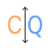

import { Card, CardGrid } from '@astrojs/starlight/components';

<CardGrid >
	<Card title="Simple Core Concepts">
    

    No clunky and complex OOP or FP design principles. No Framework Magic. Just explicit code.

    Compose an application with commands, events, and queries.
	</Card>

	<Card title="Commands & Queries">
    

    The real world doesn't operate in snapshots – instead it operates in actions, events and outcomes.

    Nimbus is a perfect fit for the CQRS pattern. Read more on [cqrs.com](https://www.cqrs.com/).
	</Card>

	<Card title="Event Sourcing">
    

    When building your application to reflect real world actions and events it is crucial to store those events properly.

    Nimbus integrates seamlessly with [EventSourcingDB](https://www.eventsourcingdb.io/).
	</Card>

	<Card title="Observability Built-In">
    

    Logging, tracing, and metrics. Batteries included.

    Nimbus uses [OpenTelemetry](https://opentelemetry.io/) for all relevant operations to provide a solid foundation for observability out of the box.
	</Card>
</CardGrid>
